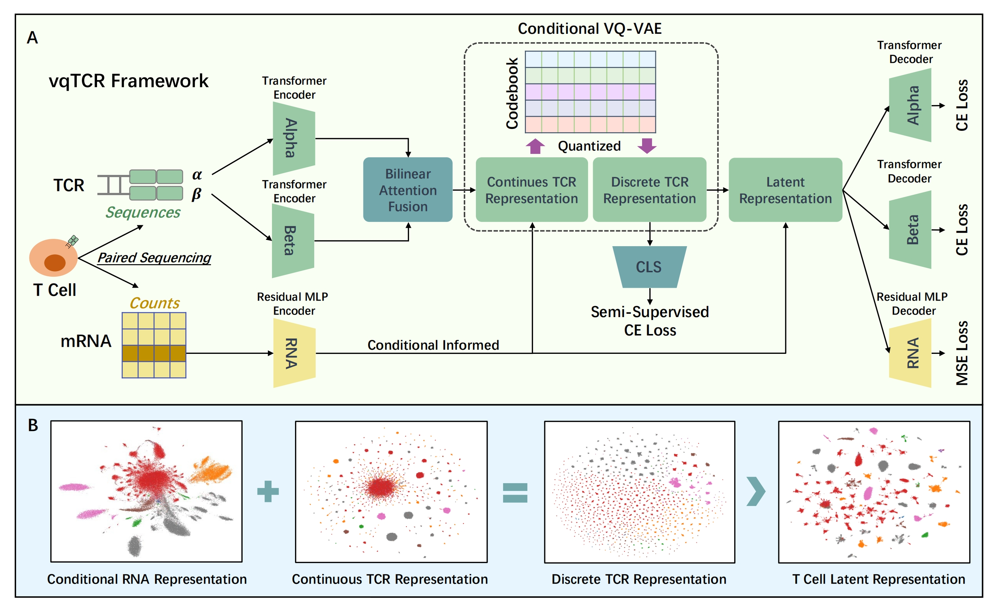

# vqTCR: Quantized immune specificity representation learning for disentangling the T cell heterogeneity from single-cell T cell receptor and transcriptomics data

A key challenge in uncovering the adaptive immune system from single-cell immune profiling is to untangle the paired high variability T cell receptors (TCRs) and heterogeneous T cell transcriptomics data. Recent methods have been proposed to capture the low dimension representation of the TCR chains and corresponding dynamic transcription profiles, while the complex variability and discrete character of TCR prevents these methods from finding patterns with biological significance. Here we propose vqTCR, a deep generative model based on the conditional vector quantized variational autoencoder to grasp the prototype representation of immune specificity from discrete TCRs and highly heterogeneous transcriptomics data. The experimental results on multiple paired scRNA-seq and scTCR-seq dataset demonstrate that vqTCR effectively capture the antigen specificity, and construct the relationship between functions and phenotypes of T cells. Specifically, vqTCR provides the variability contribution of alpha chain and beta chain, and disentangles the transcriptomics effects from multiple T cell states.

